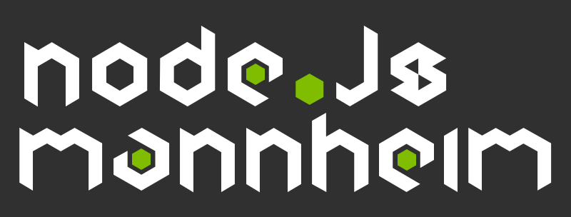

# node.js MeetUp Mannheim

Hello!

We're meeting roughly once a month in the Mannheim, Germany area to
discuss topics ranging around node.js but sometimes the topics drift
to computing or philosophy in general…

We try to set the next dates and suggest topics on our
[meetup page](http://www.meetup.com/node-js-Mannheim/), so head over
there and RSVP for the next meeting!

## Contents

We're trying to collect presentations as well as some code discussed
or even written during our meetups in this repository. If you attended
and you're missing something, please contribute!

## Contribute

Did I miss something? Most likely… Please fork this repository and
contribute your content… it's open to everybody!

If you don't know how to fork and contribute in git, just ping me
and I'll walk you through!

## License

Everything needs a license. That's good.

This work is licensed under a [Creative Commons Attribution 3.0 Germany
License](http://creativecommons.org/licenses/by/3.0/de/deed.en_US).

